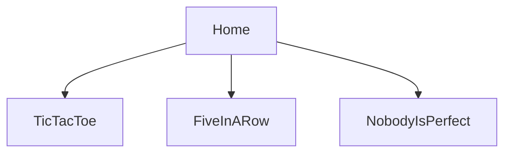

# MultiPlayer

## install

add github.settings.secrets:

- DOCKERHUB_TOKEN : <password>
- DOCKERHUB_USERNAME: <myname>
- DOCKER_REGISTRY: <name.azurecr.io>

## online multiplayer game(s).

Server (node.js)

[](https://travis-ci.org/ReneCode/MultiPlayer)

Web-Frontend (React)

[](https://app.netlify.com/sites/mpgame/deploys)

#Issues

- game_restart playerId should not be the 'current' player

#Ideas

# protocoll

## websocket-connection




```txt
SERVER                                                                          CLIENT

get "connection" -           >>  CLIENT_CONNECTED(newPlayerId) >>>
                                                                            save playerId


                                    << GAME_CONNECT(gameId,playerId) <<
game.addPlayer(playerId)
                              >> UPDATE (to all players of that game)>>>


                                    <<<< GAME_START <<<<<
 game.start()
                              >>>>> UPDATE >>>>


get "close" "update"

_Client_
get "CLIENT_CONNECTED"(playerId) - save playerId

send "GAME_CONNECT"
```
